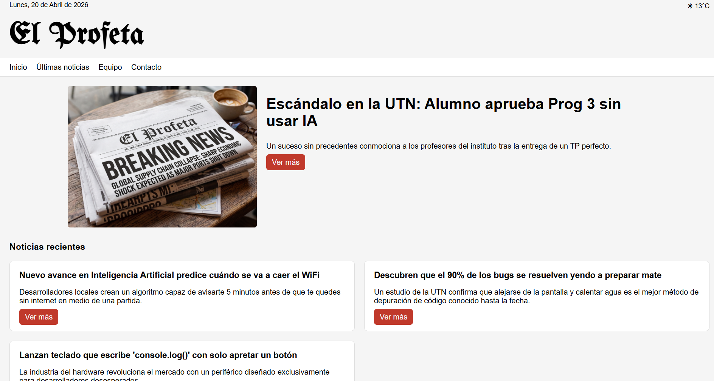

# El Profeta | Diario Digital de Actualidad



Proyecto de desarrollo web creado para el Parcial de Programación. Consiste en el desarrollo y maquetación de una plataforma periodística con estética de diario clásico, aplicando técnicas de diseño responsivo, manipulación dinámica del DOM con JavaScript y almacenamiento local, manteniendo un enfoque de código modular.

## Tecnologías y Conceptos Aplicados

* **HTML5 Semántico:** Estructura organizada para mejorar la accesibilidad, el SEO y la correcta división de los artículos periodísticos.
* **CSS3 Avanzado:**
* **Modularización:** Uso de `@import` para separar estilos por componentes (`nav.css`, `card.css`, `button.css`, `footer.css`).
* **Variables CSS (`:root`):** Centralización de la paleta de colores y bordes para mantener la consistencia temática.
* **Flexbox:** Implementación de layouts fluidos para las grillas de noticias y los menús de navegación.
* **Media Queries:** Adaptación del diseño (Responsive Web Design) para garantizar una lectura cómoda en celulares y tablets.
* **JavaScript Moderno (ES6+):**
* **Manipulación del DOM:** Creación dinámica de nodos HTML para inyectar noticias, equipos y detalles desde arrays de datos (`data.js`).
* **Lógica de Estado:** Implementación de carga incremental ("Cargar más") gestionando índices de arrays.
* **LocalStorage:** Almacenamiento persistente de datos en el navegador para simular una base de datos de noticias creadas por los usuarios.
* **Tipografías Externas:** Integración de fuentes de Google Fonts.
* **Git & GitHub:** Trabajo colaborativo mediante el uso de repositorios, gestión de ramas y control de versiones del código fuente.

## Descripción del Proyecto

El sitio web está diseñado para "El Profeta", un periódico con una propuesta visual inspirada en la tipografía y estructura de los diarios tradicionales. La plataforma permite a los usuarios explorar las noticias más recientes mediante un sistema de carga incremental, leer artículos en detalle, conocer al plantel de periodistas y participar activamente publicando sus propios titulares mediante un sistema guardado en el navegador. El sistema destaca por su interactividad, validación de datos y su capacidad de adaptarse a cualquier dispositivo móvil o de escritorio.

## Integrantes y Responsabilidades

El desarrollo se organizó bajo un sistema de trabajo colaborativo, donde cada integrante asumió el diseño y la lógica de vistas específicas, asegurando la integración con la arquitectura global del diario:

* **Priscila Arrimada:** Diseño del formulario de comunicación y programación de las validaciones de datos (`contacto.html` y `contacto.js`).
* **Tomás Astudillo:** Maquetación de la página de últimas noticias y desarrollo de la lógica del slider/carrusel de artículos (`noticias.html` y `noticias.js`)
* **Valentina Guerrieri:** Diseño y renderizado dinámico de la página de perfil de los periodistas (`equipo.html` y `equipo.js`).
* **Máximo Messina:** Arquitectura global CSS, implementación de la grilla responsiva (Media Queries), e implementación de LocalStorage para la carga de noticias de usuarios (`cargar.js` y `cargar.html`).
* **Máximo Moraes:** Desarrollo de la vista de lectura y lógica de inyección de datos para las noticias específicas (`detalle.html` y `detalle.js`).
* **Lucas Rojas:** Estructuración base del proyecto, desarrollo de la página de inicio (`script.js` y `index.html`).

## Lógica y Funciones Principales (JavaScript)

El proyecto utiliza un enfoque modular donde cada vista tiene su propio script encargado de manipular el DOM. A continuación, se detallan las funciones clave de cada archivo:

### 1. Carga Incremental de Noticias (`script.js`)

Esta función gestiona la paginación del lado del cliente en el `index.html`. Utiliza el método `.slice()` para cortar el array de noticias y mapearlo a elementos HTML, simulando una carga progresiva para no saturar el DOM.

```javascript
const renderNoticias = () => {
    // Obtenemos el segmento y lo mapeamos a HTML
    const segmento = noticiasFiltradas.slice(index, index + cantidad);
    
    const html = segmento.map(noti => `
        <article class="card">
            <div class="card-content">
                <h4>${noti.titulo}</h4>
                <p>${noti.resumen}</p>
                <a href="pages/detalle.html?id=${noti.id}" class="btn">Ver más</a>
            </div>
        </article>
    `).join('');

    cajaNoticias.insertAdjacentHTML('beforeend', html);
    
    // Actualizamos índice y revisamos si ocultar el botón
    index += cantidad;
    if (index >= noticiasFiltradas.length) btnCargarMas.remove();
}; 
```
### 2. Renderizado Dinámico de Detalle (`detalle.js`)

Extrae el ID de la noticia desde la URL para mostrar el contenido específico de cada artículo en una única plantilla dinámica.

```javascript
const params = new URLSearchParams(window.location.search);
const id = parseInt(params.get('id'));

const noti = noticias.find(n => n.id === id);
```
### 3. Control del Carrusel/Slider (`noticias.js`)

Controla el avance de las noticias destacadas en la sección de "Último Momento".

```javascript
function updateNoticia() {
    Noticias.forEach((Noticias, i) => {
        Noticias.classList.toggle("active", i === iteracion);
    });
}
```

### 4. Renderizado Dinámico del Plantel (`equipo.js`)

Se encarga de generar visualmente las tarjetas de presentación para cada periodista del diario.

```javascript
for (let i = 0; i < equipo.length; i++) {
const persona = equipo[i];

const card = document.createElement("div");
card.classList.add("card");

card.innerHTML = `
 
   
 <div class= "card-content">
    <h4>${persona.nombre}</h4>
    <p class="rol">${persona.rol}</p>

    <div class= "info-extra">
     <p>${persona.info}</p>
     <p><strong>${persona.pais}</strong></p>
     <p>${persona.experiencia}</p>
    </div>

</div>
`;   

contenedor.appendChild(card);
}
```

### 5. Validación de Formulario (`contacto.js`)

Asegura que los datos ingresados por el usuario cumplan con los requisitos antes de simular el envío.

```javascript
const soloTexto = /^[A-Za-zÁÉÍÓÚáéíóúñÑ\s]+$/;

if (!soloTexto.test(nombre)) {
  alert("El nombre solo debe contener letras");
  return;
}
```

### 6. Persistencia con LocalStorage

Permite guardar las noticias creadas por los usuarios de forma local en el navegador.

```javascript
form.addEventListener("submit", function(e) {
  e.preventDefault();
  // ... validaciones ...
  let notiusuarios = JSON.parse(localStorage.getItem("notiusuarios")) || [];
  notiusuarios.append({ titulo: titulo, resumen: resumen });
  localStorage.setItem("notiusuarios", JSON.stringify(notiusuarios));
  // ... éxito ...
});
```
